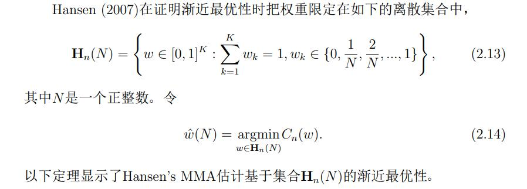
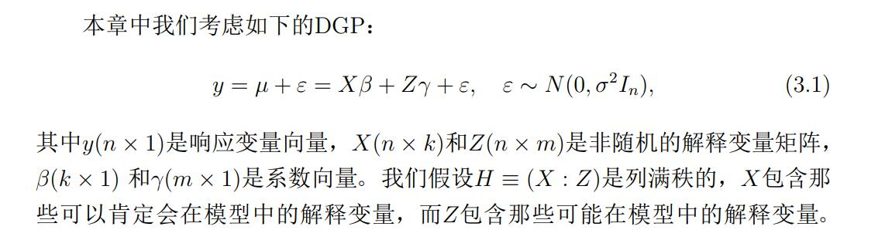

# chap1 引言
模型平均，顾名思义就是把来自不同模型的估计或者预测通过一定的权重平均起来，包括组合估计和组合预测。

#### 模型平均的动机
模型选择的缺陷：

1. 不稳健。
2. 遗失有用的信息。
3. 高风险。
4. 忽视模型选择过程所带来的不确定性。
5. 目标偏离。

模型平均可以避免这些缺陷。

#### 模型平均的起源、发展和应用
1. 起源：Barnard(1963)
2. 发展：BMA(Bayesian Model Averaging)与FMA(Frequentist Model Averaging)

BMA：设定待组合模型的先验概率和各个模型中参数的先验分布，然后用经典的贝叶斯方法进行统计推断。

FMA: 

  1. 基于信息准则的加权方法。 
  S-AIC 与 S-BIC,其组合权重为：
  $w_k = \dfrac{exp(-xIC_k/2)}{\sum_{k'}exp(-xIC_{k'}/2)}$
  
  2. 自适应方法。
  在一定条件下，它们所得的模型平均估计的风险被常数倍的模型选择估计最小风险加一个较小惩罚所界住。
  
  3. 渐进最优理论。
  Hansen(2007)提出MMA(Mallows Model Averaging)估计，
  证明了其是渐进最优的，即当把权重限定在一定集合中时，MMA估计的二次损失依概率渐进等价于用该集合中权重加权的模型平均估计的二次损失的下确界。
  但存在两个较强的假设：
      1. 权重必须限定在一个特殊的离散集合中。
      2. 待组合模型是嵌套的。
  
  4. 极限分布理论。
  Hjort & Claeskens(2003)在极大似然估计的大样本理论基础上构建了模型平均估计的极限分布理论，同时详细阐述了在使用模型选择估计时忽视模型选择过程本身所带来的不确定性的后果，并提出了解决方案。
  
#### 本文的创新工作和结构安排
  
# chap2 线性估计的模型平均方法
本章是关于线性估计的模型平均方法。

#### 2.1 前言
随机样本$y_i,i=1,\cdots,n$, DGP(Data Generating Process):
\begin{equation}
y_i = \mu_i+e_i = f(x_i)+e_i
\end{equation}
$y = (y_1,\cdots,y_n)',X = (x_1',\cdots,x_n')',\mu = (\mu_1,\cdots,\mu_n)',e=(e_1,\cdots,e_n)'$,则有：
\begin{equation}
E(y|X) = \mu, \Omega = Var(e|X)
\end{equation}

考虑$\mu$的$K$种线性估计$\{\hat{\mu}_{(1)},\cdots,\hat{\mu}_{(K)}\}$,$K$可以随样本量$n$变化，$\hat{\mu}_{(K)} = P_ky$,$P_k$只依赖$X$.

权重向量$\omega = (\omega_1,\cdots,\omega_K)'$,并限制在如下权重集合种：
$$H_n = \{\omega\in [0,1]^K: \sum\limits_{k=1}^{K}\omega_k = 1 \}$$

所以$\mu$的模型平均估计为:
$$\hat\mu(\omega) = \sum\limits_{k=1}^{K}\omega_k\hat\mu_{(k)}=\sum\limits_{k=1}^{K}\omega_kP_ky=P(\omega)y$$

记$I_n$为$n$维单位阵。令$A_k = I_n-P_k$,$A(\omega)=\sum\limits_{k=1}^{K}\omega_kA_k$,Mallows准则为：
$$C_n(\omega) = ||A(\omega)y||^2+2\sigma^2tr(P(\omega))$$

因此通过极小化Mallows准则所得到的权重为：
$$\hat\omega = argmin_{w\in H_n}C_n(\omega)$$

定义$\hat\mu(\omega)$的二次损失为
$$L_n(\omega)=||\hat\mu(\omega)-\mu||^2$$

条件风险为$R_n(\omega) = E(L_n(\omega)|X)$,所以有：
$$R_n(\omega) = ？$$

令$W$是一个权重集合，模型平均估计$\hat\mu(\hat\omega)$是基于集合$W$的渐进最优性是指：
$$\dfrac{L_n(\hat\omega)}{inf_{\omega \in W}L_n(\omega)}\stackrel{P}{\longrightarrow} 1$$

#### MMA方法
###### 概述
在[Hansen(2007)](https://www.ssc.wisc.edu/~bhansen/papers/mallows.pdf)中：

考虑$K$个近似模型，其中第$k$个近似模型为：
$$y_i = \sum\limits_{j=1}^{\phi_k}\theta_jx_{ij}+e_i, i=1,\cdots,n$$
使用前$\phi_k$个$x_{ij}$作为解释变量，$0<\phi_1<\cdots<\phi_K$,可记为：
$$y=X_k\Theta_k+e$$

###### MMA估计的渐进最优性

这个定理真复杂。。。

但接着解决了MMA估计在连续权重集合和非嵌套模型框架下的渐进最优性。

#### LMA方法
引入了LMA估计

#### JMA方法

允许数据相依，限定权重在一般的连续集合情况下，证明了JMA估计的渐进最优性。

# chap3 一种基于随机权重的模型平均估计

#### 前言
之前证明这些准则的无偏性都是把权重向量$\omega$当作非随机的，引入选择随机权重模型平均估计的准则。

# chap4 模型平均估计的比较准则

# chap5 离散响应时间序列的自适应模型平均预测

# chap6 模型平均方法的应用

