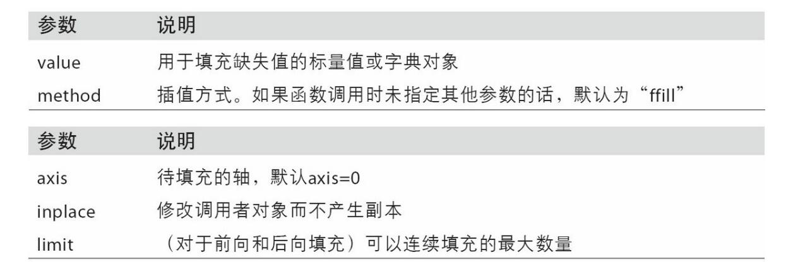
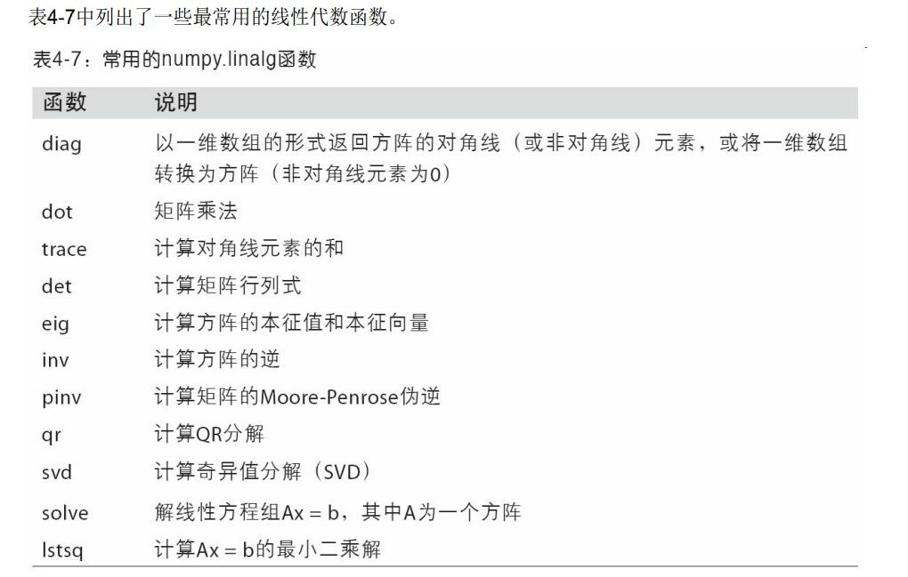
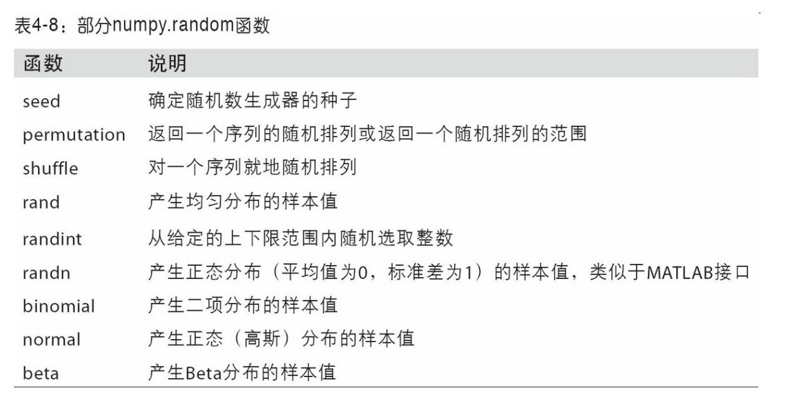
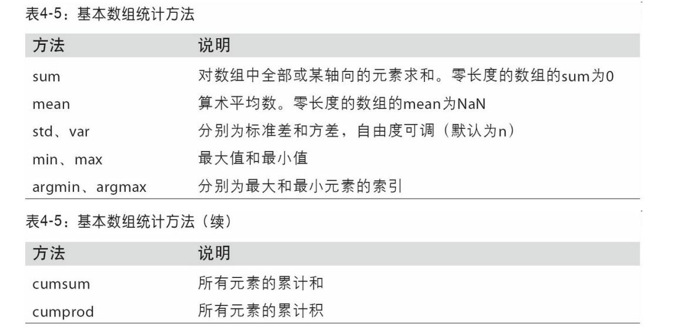
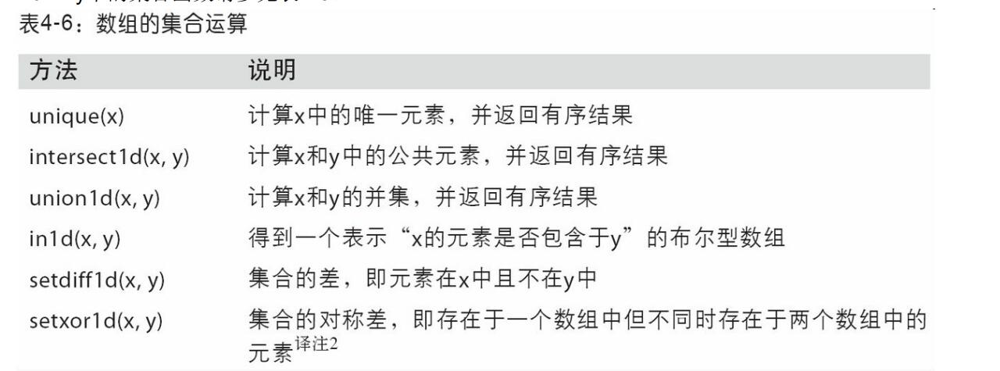

书籍列表(更新中)：

- [利用 Python 进行数据分析 · 第 2 版](https://www.bookstack.cn/read/pyda-2e-zh/README.md),第3版已于2022年更新，[第3版网址](https://wesmckinney.com/book/)

## 时间


## 5.30
- pivot与crosstab

## 5.29
- 10.2 数据聚合
- 10.3 apply

## 5.28
- 10.1 数据分组

## 5.26
- 画图
要改变x轴刻度，最简单的办法是使用`set_xticks`和`set_xticklabels`;
`ax.legend()`;
`ax.text()`

## 5.21
- `pivot`

## 5.20
爱老爸！

- `merge`
- `concat`

## 5.19
今天的裙子好骚啊emm

- 层次化索引（hierarchical indexing）
`unstack` `stack` `swaplevel` `sort_index` `set_index`

## 5.18
打扫卫生令人疲惫

- 排列和随机采样`sample`
- 计算指标/哑变量`dummies = pd.get_dummies(df['key'], prefix='key')`
- 处理字符串
- 正则表达式好难[本地文件](file:///G:/python%E5%AD%A6%E4%B9%A0%E8%B5%84%E6%96%99/python/%E7%88%AC%E8%99%AB%E5%B5%A9%E5%A4%A9/6%20%E6%AD%A3%E5%88%99%E8%A1%A8%E8%BE%BE%E5%BC%8F.pdf)

## 5.17
扭伤后正确处理步骤：立马冷敷，24h后热敷！希望我再也用不到这样的知识！

- `pd.read_sql()`
- `fillna()`

- `replace` `rename` `cut`等
## 5.16
我、瘸、了呜呜呜

- 简单统计
```
data = pd.DataFrame({'Qu1': [1, 3, 4, 3, 4], 'Qu2': [2, 3, 1, 2, 3],'Qu3': [1, 5, 2, 4, 4]})
result = data.apply(pd.value_counts).fillna(0)
```
- 读写文本格式的数据
层次花索引
```
from lxml import objectify
from io import StringIO
tag = '<a href="http://www.google.com">Google</a>'
root = objectify.parse(StringIO(tag)).getroot()
```

## 5.14
今日有了新想法💪💪💪

- Series
```
obj = pd.Series([4, 7, -5, 3], index=['d', 'b', 'a', 'c'])
# 它会根据运算的索引标签自动对齐数据
obj.name = 'population'
obj.index.name = "state"
```
- DataFrame
```
data = {'state': ['Ohio', 'Ohio', 'Ohio', 'Nevada', 'Nevada', 'Nevada'],
'year': [2000, 2001, 2002, 2001, 2002, 2003],
'pop': [1.5, 1.7, 3.6, 2.4, 2.9, 3.2]}
frame = pd.DataFrame(data)

pop = {'Nevada': {2001: 2.4, 2002: 2.9},'Ohio': {2000: 1.5, 2001: 1.7, 2002: 3.6}}
frame = pd.DataFrame(pop)#外层字典的键作为列，内层键则作为行索引：
frame.T #转置
frame3.values
```
  - Index对象是不可变的，因此用户不能对其进行修改
- 重新索引`obj2 = obj.reindex(['a', 'b', 'c', 'd', 'e'])`,对与dataframe来说列可以用`columns`关键字重新索引
- `drop`丢弃
- 索引 `loc`（标签）`iloc`（整数）
- 默认情况下，DataFrame和Series之间的算术运算会将Series的索引匹配到DataFrame的列，然后
沿着行一直向下广播
-  `frame.apply(f, axis='columns')` `applymap`与`map`
- 排序`frame.sort_index(axis=1, ascending=False, by=)` rank?


## 5.13
- `np.save(),np.load()`
- `x.dot(y)`等价于`np.dot(x, y)`
- 求解行列式等
```
from numpy.linalg import inv, qr
X = np.random.randn(5, 5)
mat = X.T.dot(X)
inv(mat)
mat.dot(inv(mat))
q, r = qr(mat)
```



## 5.12
```
arr = np.random.randn(7) * 5
remainder, whole_part = np.modf(arr)#它会返回浮点数数组的小数和整数部分
```
```
points = np.arange(-5, 5, 0.01) 
xs, ys = np.meshgrid(points, points)
z = np.sqrt(xs ** 2 + ys ** 2)
import matplotlib.pyplot as plt
plt.imshow(z, cmap=plt.cm.gray); plt.colorbar()
plt.title("Image plot of $\sqrt{x^2 + y^2}$ for a grid of values")
```
- 条件表达

```
arr = np.random.randn(4, 4)
np.where(arr > 0, 2, arr) # set only positive values to 2
```




## 5.11
- 花式索引(Fancy indexing) 是一个NumPy术语，它指的是利用整数数组进行索引。花式索引跟切片不一样，它总是将数据复制到新数组中。
- 转置是重塑的一种特殊形式，它返回的是源数据的视图（不会进行任何复制操作）。数组不仅有`transpose`方法，还有一个特殊的T属性:
```
#利用np.dot计算矩阵内积
arr = np.random.randn(6, 3)
np.dot(arr, arr.T)
```
- 对于高维数组，transpose需要得到一个由轴编号组成的元组才能对这些轴进行转置,ndarray还有一个swapaxes方法，它需要接
受一对轴编号


## 5.10
今天组合摸鱼哈哈哈来了！

- ndarray是一个通用的同构数据多维容器，也就是说，其中的所有元素必须是相同类型的。每个数组都有一个shape（一个表示各维度大小的元组）和一个dtype（一个用于说明数组数据类型的对象）
- 通过ndarray的`astype`方法明确地将一个数组从一个dtype转换成另一个dtype

我可真是太困了，为什么组会不分个本硕博三个等级开呢呜呜呜😭😭😭

## 5.9
- 字典的`setdefault`
- `collections`模块有一个很有用的类,`defaultdict`
- **可哈希性**:字典的值可以是任意Python对象，而键通常是不可变的标量类型（整数、浮点型、字符串）或元
组（元组中的对象必须是不可变的）
- 集合使用方法：

- 内置的`map`函数，它用于在一组数据上应用一个函数
- 能以一种一致的方式对序列进行迭代（比如列表中的对象或文件中的行）是Python的一个重要特点。**迭代器**是一种特殊对象，它可以在诸如for循环之类的上下文中向Python解释器输送对象。
- 生成器（generator）是构造新的可迭代对象的一种简单方式。一般的函数执行之后只会返回单个
值，而生成器则是以延迟的方式返回一个值序列，即每返回一个值之后暂停，直到下一个值被请求时再继续。要创建一个生成器，只需将函数中的return替换为yeild即可。
groupby可以接受任何序列和一个函数。它根据函数的返回值对序列中的连续元素进行分组。
```
import itertools
first_letter = lambda x: x[0]
names = ['Alan', 'Adam', 'Wes', 'Will', 'Albert', 'Steven']
for letter, names in itertools.groupby(names, first_letter):
  print(letter, list(names)) # names is a generator
```
到78页了，这个[生成器迭代器](https://www.runoob.com/python3/python3-iterator-generator.html)有搞头
[这个也不错](https://zhuanlan.zhihu.com/p/341439647)

## 5.8
啊我刚看完R的数据类型头大了哈哈哈✋

- Python最近新增了更多高级的元组拆分功能，允许从元组的开头“摘取”几个元素。它使用了特殊的
语法 `*_`
- 用`extend`方法要比`+`串联快
-  `bisect`模块，`bisect.bisect` 可以找到插入值后仍保证排序的位置， `bisect.insort` 是向这个位置插入值
- `enumerate`😎
- `zip` 可以将多个列表、元组或其它序列成对组合成一个元组列表：

今天看到57页！


## 5.7
一些行话：

- Munge/Munging/Wrangling：数据规整
- Pseudocode 伪码
- Syntactic sugar 语法糖

- Tab可以补全~
- 在变量前后使用问号，可以显示对象的信息
- jupyter notebook快捷键：


- 魔术命令是在指令前添加百分号%前缀。例如，可以用 `%timeit`测量任何Python语句,用 `%quickref` 或 `%magic` 学习下所有特殊命令。


- 可以用 `obj.attribute_name` 访问属性和方法
- 经常地，你可能不关心对象的类型，只关心对象是否有某些方法或用途。这通常被称为“鸭子类型”😃来自“走起来像鸭子、叫起来像鸭子，那么它就是鸭子”的说法。
- 三元表达式 `"positive" if x >= 0 else "negative`
- datetime

```
from datetime import datetime, date, time
dt = datetime(2011, 10, 29, 20, 30, 21)
dt.strftime('%m/%d/%Y %H:%M')#strftime 方法可以将datetime格式化为字符串
datetime.strptime('20091031', '%Y%m%d')
#strptime 可以将字符串转换成 datetime 对象。
```

