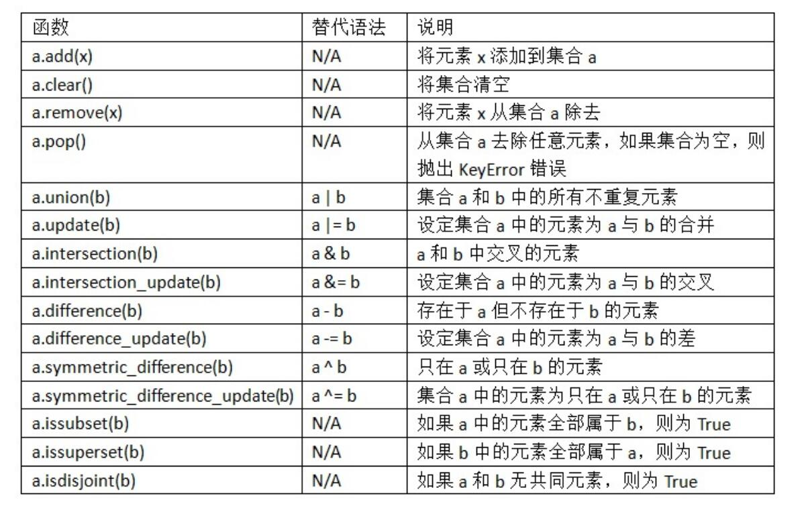
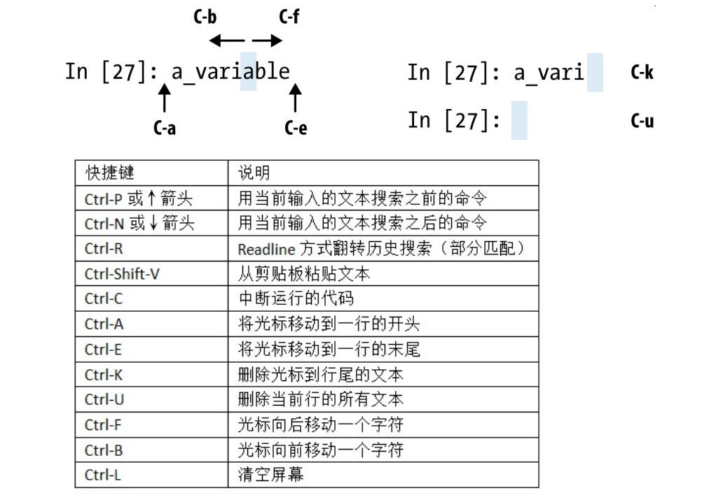
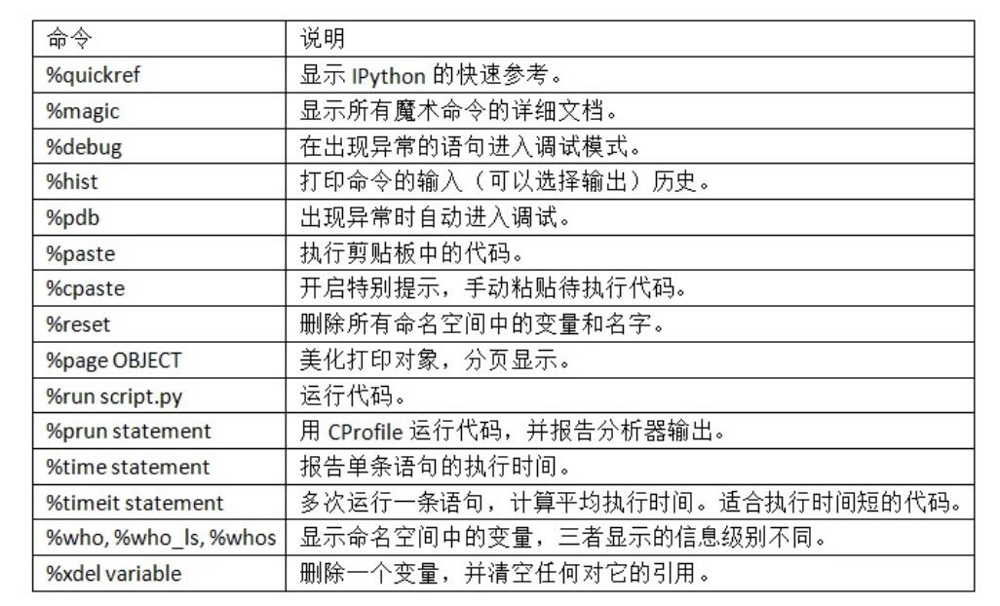

书籍列表(更新中)：

- [利用 Python 进行数据分析 · 第 2 版](https://www.bookstack.cn/read/pyda-2e-zh/README.md),第3版已于2022年更新，[第3版网址](https://wesmckinney.com/book/)

## 5.10
今天组合摸鱼哈哈哈来了！

- ndarray是一个通用的同构数据多维容器，也就是说，其中的所有元素必须是相同类型的。每个数组都有一个shape（一个表示各维度大小的元组）和一个dtype（一个用于说明数组数据类型的对象）
- 通过ndarray的`astype`方法明确地将一个数组从一个dtype转换成另一个dtype

我可真是太困了，为什么组会不分个本硕博三个等级开呢呜呜呜😭😭😭

## 5.9
- 字典的`setdefault`
- `collections`模块有一个很有用的类,`defaultdict`
- **可哈希性**:字典的值可以是任意Python对象，而键通常是不可变的标量类型（整数、浮点型、字符串）或元
组（元组中的对象必须是不可变的）
- 集合使用方法：

- 内置的`map`函数，它用于在一组数据上应用一个函数
- 能以一种一致的方式对序列进行迭代（比如列表中的对象或文件中的行）是Python的一个重要特点。**迭代器**是一种特殊对象，它可以在诸如for循环之类的上下文中向Python解释器输送对象。
- 生成器（generator）是构造新的可迭代对象的一种简单方式。一般的函数执行之后只会返回单个
值，而生成器则是以延迟的方式返回一个值序列，即每返回一个值之后暂停，直到下一个值被请求时再继续。要创建一个生成器，只需将函数中的return替换为yeild即可。
groupby可以接受任何序列和一个函数。它根据函数的返回值对序列中的连续元素进行分组。
```
import itertools
first_letter = lambda x: x[0]
names = ['Alan', 'Adam', 'Wes', 'Will', 'Albert', 'Steven']
for letter, names in itertools.groupby(names, first_letter):
  print(letter, list(names)) # names is a generator
```
到78页了，这个[生成器迭代器](https://www.runoob.com/python3/python3-iterator-generator.html)有搞头
[这个也不错](https://zhuanlan.zhihu.com/p/341439647)

## 5.8
啊我刚看完R的数据类型头大了哈哈哈✋

- Python最近新增了更多高级的元组拆分功能，允许从元组的开头“摘取”几个元素。它使用了特殊的
语法 `*_`
- 用`extend`方法要比`+`串联快
-  `bisect`模块，`bisect.bisect` 可以找到插入值后仍保证排序的位置， `bisect.insort` 是向这个位置插入值
- `enumerate`😎
- `zip` 可以将多个列表、元组或其它序列成对组合成一个元组列表：

今天看到57页！


## 5.7
一些行话：

- Munge/Munging/Wrangling：数据规整
- Pseudocode 伪码
- Syntactic sugar 语法糖

- Tab可以补全~
- 在变量前后使用问号，可以显示对象的信息
- jupyter notebook快捷键：



- 魔术命令是在指令前添加百分号%前缀。例如，可以用 `%timeit`测量任何Python语句,用 `%quickref` 或 `%magic` 学习下所有特殊命令。



- 可以用 `obj.attribute_name` 访问属性和方法
- 经常地，你可能不关心对象的类型，只关心对象是否有某些方法或用途。这通常被称为“鸭子类型”😃来自“走起来像鸭子、叫起来像鸭子，那么它就是鸭子”的说法。
- 三元表达式 `"positive" if x >= 0 else "negative`
- datetime

```
from datetime import datetime, date, time
dt = datetime(2011, 10, 29, 20, 30, 21)
dt.strftime('%m/%d/%Y %H:%M')#strftime 方法可以将datetime格式化为字符串
datetime.strptime('20091031', '%Y%m%d')
#strptime 可以将字符串转换成 datetime 对象。
```

