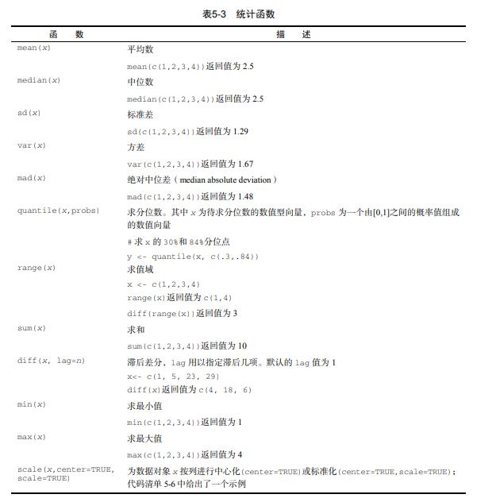
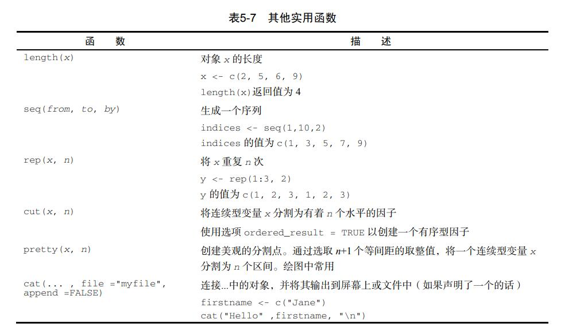
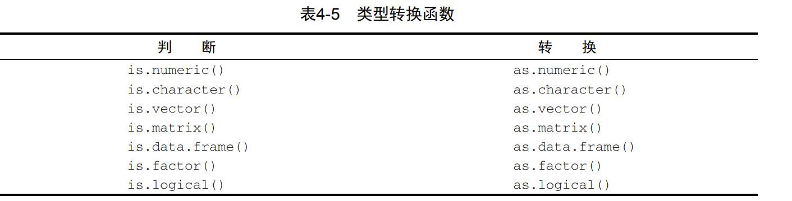

这三种语言说熟悉也熟悉，但总觉得缺乏一种系统感，那就每天花点时间浏览一些书籍记录一下吧！

书籍列表(更新中)：

- R语言实战(第2版)
```{r setup, include=T}
knitr::opts_chunk$set(echo = T,collapse = T,
                      results = "hide")
```


## 5.12
昨晚是被蚊子毁掉的睡眠！
```{r}
x <- c(1, 2, 3, 4, 5, 6, 7, 8)
mean(x)
sd(x)
```


```{r}
# normal distribution
library(MASS)
options(digits=3)
set.seed(1234)
mean <- c(230.7, 146.7, 3.6)           
sigma <- matrix( c(15360.8, 6721.2, -47.1,                           6721.2, 4700.9, -16.5,
            -47.1,  -16.5,   0.3), nrow=3, ncol=3)
mydata <- mvrnorm(500, mean, sigma)             
mydata <- as.data.frame(mydata)                   
names(mydata) <- c("y", "x1", "x2")               
dim(mydata)
head(mydata, n=10)   
```

- 字符串处理函数
- 其他有用函数

- R中提供了一个`apply()`函数，可将一个任意函数“应用”到矩阵、数组、数据框的任何维
度上。`apply()`函数的使用格式为：
`apply(x, MARGIN, FUN, ...)`

## 5.11
答辩让我好疲惫。。

- 日期
```{r}
mydates <- as.Date(c("2007-06-22","2004-02-13")) 
today <- Sys.Date() 
format(today, format="%B %d %Y") 
dob <- as.Date("2000-01-02")
difftime(today, dob, units="weeks") 
#strDates <- as.character(dates)将日期转为字符
```

 

```{r}
a <- c(1, 2, 3)
a
is.numeric(a)
is.vector(a)
a <- as.character(a)
a
is.numeric(a)
is.vector(a)
is.character(a)
```

- 使用`order()`函数对一个数据框进行排序。默认的排序顺序是升序。在排序变量的前边加一个减号即可得到降序的排序结果
- 横向合并两个数据框（数据集），使用`merge()`函数，`rbind(),cbind()`
- `subset()`函数大概是选择变量和观测最简单的方法
- `sample()`函数能够让你从数据集中（有放回或无放回地）抽取大小为n的一个随机样本
```{r}
library(sqldf)
newdf <- sqldf("select * from mtcars where carb=1 order by mpg", 
    row.names = TRUE)
newdf <- sqldf("select avg(mpg) as avg_mpg, avg(disp) as avg_disp,
    gear from mtcars where cyl in (4, 6) group by gear")
```

## 5.10
```{r}
mydata <- data.frame(x1 = c(2, 2, 6, 4), x2 = c(3, 4, 2, 8))
mydata$sumx <- mydata$x1 + mydata$x2
mydata$meanx <- (mydata$x1 + mydata$x2)/2
attach(mydata)
mydata$sumx <- x1 + x2
mydata$meanx <- (x1 + x2)/2
detach(mydata)
mydata <- transform(mydata, sumx = x1 + x2, meanx = (x1 + x2)/2)
```

- plyr包中有一个`rename()`函数，可用于修改变量名 
```{r}
y <- c(1, 2, 3, NA) 
print(is.na(y))
x <- c(1, 2, NA, 3) 
print(sum(x, na.rm=TRUE))
```
- `na.omit()`可以删除所有含有缺失数据的行

## 5.9

```{r}
attach(mtcars)
plot(wt, mpg)
abline(lm(mpg ~ wt))
title("Regression of MPG on Weight")
detach(mtcars)
```
- 可用`par(optionname=value,optionname=name,...)`修改图形参数，也可用高级绘图函数直接提供的optionname=value的键值对
- 函数`colors()`可以返回所有可用颜色的名称
- 函数`plotmath()`可以为图形主体或边界上的标题、坐标轴名称或文本标注添加数学符号
- `layout()`👍

## 5.8

```{r}
#矩阵
y = matrix(1:20,nrow = 5, ncol = 4)
y
cells <- c(1, 26, 24, 68)
rnames <- c("R1", "R2")
cnames <- c("C1", "C2")
mymatrix <- matrix(cells, nrow = 2, ncol = 2, byrow = TRUE, 
    dimnames = list(rnames, cnames))
mymatrix
mymatrix <- matrix(cells, nrow = 2, ncol = 2, byrow = FALSE, 
    dimnames = list(rnames, cnames))
mymatrix
#数组：个创建三维（2×3×4）数值型数组
dim1 <- c("A1", "A2")
dim2 <- c("B1", "B2", "B3")
dim3 <- c("C1", "C2", "C3", "C4")
z <- array(1:24, c(2, 3, 4), dimnames = list(dim1, dim2, dim3))
z
```

```{r}
#创建数据框
patientID <- c(1, 2, 3, 4)
age <- c(25, 34, 28, 52)
diabetes <- c("Type1", "Type2", "Type1", "Type1")
status <- c("Poor", "Improved", "Excellent", "Poor")
patientdata <- data.frame(patientID, age, diabetes, 
    status)
patientdata
patientdata$age
table(patientdata$diabetes, patientdata$status)#生成糖尿病类型变量diabetes和病情变量status的列联表
```

- 函数attach()可将数据框添加到R的搜索路径中。R在遇到一个变量名以后，将检查搜索路径中的数据框，但是[R代码风格说明](https://google.github.io/styleguide/Rguide.html)里说最好不要用噢哈哈哈
- **with**
- 类别（名义型）变量和有序类别（有序型）变量在R中称为因子（factor）
```{r}
patientID <- c(1, 2, 3, 4)
age <- c(25, 34, 28, 52)
diabetes <- c("Type1", "Type2", "Type1", "Type1")
status <- c("Poor", "Improved", "Excellent", "Poor")
diabetes <- factor(diabetes)
status <- factor(status, order = TRUE)
patientdata <- data.frame(patientID, age, diabetes, status)
str(patientdata)
```

- edit() 可以修改数据


## 5.7

```{r}
help.start()
help(package = "vcd")
library(vcd) 
help(Arthritis) #阅读数据集Arthritis的描述
Arthritis 
example(Arthritis)# 运行数据集Arthritis自带的示例
#q()
```

