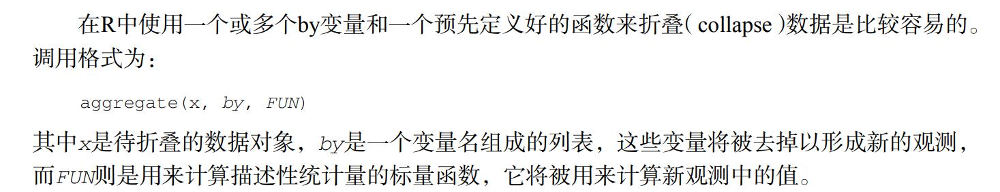

这三种语言说熟悉也熟悉，但总觉得缺乏一种系统感，那就每天花点时间浏览一些书籍记录一下吧！

书籍列表(更新中)：

-   R语言实战(第2版)
-   [现代统计图形](https://bookdown.org/xiangyun/msg/)

```{r setup, include=T}
knitr::opts_chunk$set(echo = T,collapse = T,
                      results = "hide")
```

## 5.31
```{r}
example(persp)
```
```{r}
par(mar = c(4, 4, 0.2, 0.2))
sunflowerplot(iris[, 3:4], col = "gold", seg.col = "gold")
```
```{r}
demo("symbols_all", echo = FALSE, package = "MSG")
```

## 5.29
人世几回伤往事，山形依旧枕寒流。唉
```{r}
demo("volcano", package = "MSG")
```
- 四瓣图
四瓣图最终的读法就是观察两瓣相邻扇形的置信区间弧线是否有重叠，有则说明不能拒绝零假设，反之可以拒绝
```{r}
ftable(UCBAdmissions) # 以紧凑形式展现出来的 UCB 录取数据
fourfoldplot(UCBAdmissions, mfcol = c(2, 3)) # 2 行 3 列排版
```
- 颜色图
```{r}
par(mar = rep(0, 4))
x <- matrix(sample(24), 8)
image(1:8, 1:3, x, col = heat.colors(24), axes = FALSE, ann = FALSE)
text(rep(1:8, 3), rep(1:3, each = 8), as.vector(x))
```

- 矩阵图
```{r}
sines <- outer(1:20, 1:4, function(x, y) sin(x / 20 * pi * y))
par(mar = c(2, 4, .1, .1))
matplot(sines, type = "b", pch = 21:24, col = 2:5, bg = 2:5)

```
- 马赛克图
```{r}
ftable(Titanic)
par(mar = c(2, 3.5, .1, .1))
mosaicplot(Titanic, shade = TRUE, main = "")
```

## 5.28
- 等高线
- 条件分布
- 一元函数曲线
```{r}
par(par(mar = c(4.5, 4, 0.2, 0.2)), mfrow = c(2, 1))
chippy <- function(x) sin(cos(x) * exp(-x / 2))
curve(chippy, -8, 7, n = 2008, xlab = "$x$", ylab = "$\\mathrm{chippy}(x)$")
curve(sin(x) / x, from = -20, to = 20, n = 200, 
      xlab = "$t$", ylab = "$\\varphi_{X}(t)$")

```

## 5.27
以后以日期为准，不以今天、明天这样含糊的词语
```{r}
(x <- margin.table(HairEyeColor, c(1, 2)))
assocplot(x)
```


## 5.26
- 箱线图（boxplot）

- 条形图
```{r}
library(RColorBrewer) # 用分类调色板
par(mfrow = c(2, 1), mar = c(3, 2.5, 0.5, 0.1))
death <- t(VADeaths)[, 5:1]
barplot(death, col = brewer.pal(4, "Set1"))
barplot(death,
  col = brewer.pal(4, "Set1"), beside = TRUE,
  legend.text = TRUE
)
```
- 散点图
```{r}
demo("alphaDemo", package = "MSG")
```

## 5.25
- bootstrap方法
```{r}
x=c(18.2,9.5,12.0,21.1,10.2)
theta<-median(x)
bootstrap<-function(x,B=10000){
        set.seed(123)
        G<-matrix(0,B,length(x))
        for(i in 1:B){
                G[i,]<-t(matrix(sample(x,length(x),replace = T)))
        }
        return(G)
}
#运行时间
tic<-proc.time()
b<-matrix(apply(bootstrap(x),1,median),1)
toc<-proc.time()
print(toc-tic)
#误差计算
(sd<-sqrt(((b)-mean(b))%*%(t(b)-mean(b))/(length(b)-1)))
(mean(b))
```
- 茎叶图（Stem-and-Leaf Plot）
```{r}
head(islands, 10)#该数据记录了世界上各大陆地块的面积大小，原始数据前 10 条如下（单位：千平方英里）
stem(islands)
# 均值 lambda 为 10 的泊松分布随机数
sort(x <- rpois(80, lambda = 10))
stem(x, scale = 2)
```


## 5.23
peer pressure

- 直方图（Histogram）
```{r}
par(mfrow = c(2, 2), mar = c(2, 3, 2, .5), mgp = c(2, .5, 0))
data(geyser, package = "MASS")
hist(geyser$waiting, main = "(1) freq = TRUE", xlab = "waiting")
hist(geyser$waiting, freq = FALSE, xlab = "waiting", main = "(2) freq = FALSE")
hist(geyser$waiting, breaks = 5, density = 10, xlab = "waiting", main = "(3) breaks = 5")
hist(geyser$waiting, breaks = 40, col = "red", xlab = "waiting", main = "(4) breaks = 40")

library(ggplot2)
library(cowplot)
p <- ggplot(aes(waiting), data = geyser)
p1 <- p + geom_histogram(breaks = seq(40, 110, by = 5))
p2 <- p + geom_histogram(breaks = seq(40, 110, by = 5), aes(y = ..density..))
p3 <- p + geom_histogram(breaks = seq(40, 110, by = 10))
p4 <- p + geom_histogram(breaks = seq(42, 108, by = 2), fill = "red", color = "black")
plot_grid(p1, p2, p3, p4, labels = c(
  "(1) freq = TRUE",
  "(2) freq = FALSE",
  "(3) breaks = 5",
  "(4) breaks = 40"
), ncol = 2)
```

```{r}
demo("hist_geyser", package = "MSG")
df <- data.frame(
  x = seq(40, 110, 5), y = 0,
  xend = seq(40, 110, 5), yend = ht
)
p2 + geom_density(fill = "lightgray", color = "black") +
  geom_segment(aes(x = x, y = y, xend = xend, yend = yend),
    data = df, lty = 3
  )

```

## 5.21
- 瀑布图
```{r}
# 七天之内的唯一访问次数数据（周一为 2010 年 8 月 2 日）
auv <- c(939, 1005, 973, 910, 875, 658, 688)
# 相邻两天作差
diff(auv)
par(mar = c(4, 4, .5, .1))
plot(auv,
  xlab = "八月第一周",
  ylab = "绝对唯一访问次数", type = "n",
  xlim = c(0.5, 7.5),
  ylim = c(0, max(auv)),
  xaxt = "n", panel.first = grid()
)
axis(1, 1:7, sprintf("周%s", c(
  "一", "二", "三", "四", "五", "六", "日"
)))
rect(1:7 - 0.3, c(0, auv[1:6]), 1:7 + 0.3, auv,
  col = c(NA, ifelse(diff(auv) < 0, "red", NA))
)

```

- SGD
```{r}
# 本例的目标函数也可以用 R 自身的 optim() 函数来求极小值，它的收敛代码为 0，表示这个计算结果在一定条件下可以收敛（但不代表找到了全局最小值，甚至不代表找到了局部最小值）
f2 <- function(x) sin(1 / 2 * x[1]^2 - 1 / 4 * x[2]^2 + 3) *
    cos(2 * x[1] + 1 - exp(x[2]))
# par 为局部解；value 为目标函数值； convergence 为收敛指示代码
optim(c(-.9, .9), f2, method = "L-BFGS-B", lower = c(-1, .5), upper = c(1, 2.2))
```
```{r}
demo("gradArrows1", package = "MSG")
```

## 5.20

- 矩形、多边形
```{r}
x <- rnorm(40) # 产生 40 个正态随机数
plot(x, xlab = "", type = "l") # 画线图
# 请思考为什么坐标值要这样设置：多边形的连线路径
polygon(c(1, 1:40, 40), c(0, x, 0), col = "gray")
xy <- par("usr") # 获取当前图形区域坐标范围，以便下用
# 用白色矩形挡住了 0 以下的部分
rect(xy[1], xy[3], xy[2], 0, col = "white")
lines(x) # 重画一遍 x 的线条
abline(h = 0, col = "lightgray") # 添加水平线
```

- 网格线、文本、图例
```{r}
par(mar = c(4, 4, 4, 3))
plot(0:10, type = "n", xlab = "", ylab = "", xlim = c(0, 12))
grid(col = "gray")
title(
  main = "Demonstration of text in R Graphics",
  xlab = "X-axis title", ylab = "Y-axis title"
)
mtext("Here is \"side = 4\"", side = 4, line = 1)
x <- c(6, 4, 6, 8)
y <- c(8, 5, 2, 5)
s <- c(0, 90, 180, 270)
for (i in 1:4) {
  text(x[i], y[i], sprintf("srt = %d", s[i]), srt = s[i])
}
segments(c(6, 0, 6, 12), c(10, 5, 0, 5), c(0, 6, 12, 6),
  c(5, 0, 5, 10),
  lty = c(2, 1, 1, 2)
)
legend(-0.2, 9.8, c("Upper", "Lower"),
  lty = 2:1, cex = 0.8,
  bty = "n" 
)
```

## 5.19
- 点
关于点的设置，我们既可以在很多作图函数中用 `pch`（点的符号）， 等参数实现，也可以在用低层函数 `points()` 向已有图形中添加点来实现

```{r}
demo("pointTypes", package = "MSG")
```
```{r}
# 先将鸢尾花的类型转化为整数 1、2、3，便于使用向量
idx <- as.integer(iris[["Species"]])
plot(iris[, 3:4],
  pch = c(24, 21, 25)[idx],
  col = c("black", "red", "blue")[idx], panel.first = grid()
)
legend("topleft",
  legend = levels(iris[["Species"]]),
  col = c("black", "red", "blue"), pch = c(24, 21, 25), bty = "n"
)
```
```{r}
par(mar = c(0.2, 0.2, 0.2, 0.2), mfrow = c(2, 2))
for (n in c(63, 60, 76, 74)) {
  set.seed(711)
  plot.new()
  box()
  size <- c(replicate(n, 1 / rbeta(2, 1.5, 4)))
  center <- t(replicate(n, runif(2)))[rep(1:n, each = 2), ]
  color <- paste("#", apply(
    replicate(2 * n, sample(c(0:9, LETTERS[1:6]), 8, TRUE)), 2, paste,
    collapse = ""
  ), sep = "")
  points(center, cex = size, pch = rep(20:21, n), col = color)
}

```
- 曲线、直线、线段、箭头、X-样条

画线的函数：

1. abline(a = NULL, b = NULL, h = NULL, v = NULL, reg = NULL, coef = NULL,untf = FALSE, ...)
2. segments(x0, y0, x1 = x0, y1 = y0, col = par("fg"), lty = par("lty"),lwd = par("lwd"), ...)
3. arrows(x0, y0, x1 = x0, y1 = y0, length = 0.25, angle = 30, code = 2, col = par("fg"), lty = par("lty"), lwd = par("lwd"), ...)
4. xspline(x, y = NULL, shape = 0, open = TRUE, repEnds = TRUE, draw = TRUE,border = par("fg"), col = NA, ...)
```{r}
# 不作图，只画出框架，且指定坐标轴范围
plot(1:10, type = "n", xlim = c(0, 10), ylim = c(0, 10))
lines(1:10, abs(rnorm(10))) # 10 个正态随机数绝对值的波动线
abline(a = 0, b = 1, col = "gray") # 不同的直线
abline(v = 2, h = 2, lty = 2)
text(8, 3, "abline(a = 0, b = 1)") # 添加文本
arrows(8, 3.5, 6, 5.7, angle = 40) # 添加箭头
# 参数用了向量：不同灰度的线段
segments(rep(3, 4), 6:9, rep(5, 4), 6:9, col = gray(seq(0.2, 0.8, length = 4)))
text(4, 9.8, "segments")
```


## 5.18

- 今天研究一下颜色！
1.  固定颜色选择函数
```{r}
# color() 657种颜色
pdf("colors-bar.pdf", height = 120)
par(mar = c(0, 10, 3, 0) + 0.1, yaxs = "i")
barplot(rep(1, length(colors())),
  col = rev(colors()), names.arg = rev(colors()), horiz = TRUE,
  las = 1, xaxt = "n", main = expression("Bars of colors in" ~ italic(colors()))
)
dev.off()

palette() # 默认的调色板颜色
palette("default") # 恢复默认调色板
#我们可以在 R中使用一个整数来表示颜色，而这个整数对应的颜色就是调色板中相应位置的颜色
```
2. 颜色生成和转换函数
```{r}
#颜色生成模型1: RGB 模型（红绿蓝三原色混合)
#2: HSV 色彩模型,色调（Hue）、饱和度（Saturation）和纯度（Value）
# 3: HCL 色彩模型,色调（Hue）、色度（Chroma）和亮度（Luminance）
# 4: 灰色生成模型
barplot(rep(1,5),col = gray(seq(0, 1, length = 5)))
# 两种颜色转换函数rgb2hsv()与col2rgb
col2rgb("yellow") # 黄色是由红绿混合得到的
```
3. 调色板
```{r}
library(RColorBrewer)
layout(matrix(1:3, 3), heights = c(2, 1, 1))
par(mar = c(0, 4, 0, 0))
display.brewer.all(type = "seq") # 连续型：18 种
display.brewer.all(type = "div") # 极端化：9 种
display.brewer.all(type = "qual") # 离散型：8 种
```

```{r}
xx <- c(1912, 1912:1971, 1971)
yy <- c(min(nhtemp), nhtemp, min(nhtemp))
plot(xx, yy, type = "n", xlab = "Year", ylab = "Temperatures")#无图
for (i in seq(255, 0, -3)) {
  yy <- c(45, nhtemp - (nhtemp - min(nhtemp)) * (1 - i / 255), 45) # rgb() 中的绿色成分逐渐变小
  polygon(xx, yy, col = rgb(1, i / 255, 0), border = NA)
  Sys.sleep(0.05)
  # 读者可以在这里加上 Sys.sleep(0.05) 以便看清作图过程
}
box() # 补齐边框

```
4. 颜色混合
```{r}
#out = alpha * new + (1 - alpha) * old
x <- rgb(1, seq(0, 1, length = 30), 0)
barplot(rep(1, 30), col = x)
# 三原色
x = rep(1,6)
names(x) = c("red","green","blue","magenta","yellow","cyan")
red = rgb(1,0,0,1)
green = rgb(0,1,0,1)
blue = rgb(0,0,1,1)
magenta = rgb(1,0,1,1)
yellow = rgb(1,1,0)
cyan = rgb(0,1,1)
barplot(x,col=c(red,green,blue,magenta,yellow,cyan) )
```

## 5.17

```{r}
troops <- read.table(system.file("extdata", "troops.txt", package = "MSG"), header = TRUE)
cities <- read.table(system.file("extdata", "cities.txt", package = "MSG"), header = TRUE)
library(ggplot2)
p <- ggplot(cities, aes(x = long, y = lat)) # 框架
p <- p + geom_path(aes(size = survivors, colour = direction, group = group), 
                   data = troops, lineend = "round") # 军队路线
p <- p + geom_point() # 城市点
p <- p + geom_text(aes(label = city), hjust = 0, vjust = 1, size = 2.5) # 城市名称
p <- p + scale_colour_manual(values = c("grey50", "red")) + 
  scale_size(range = c(1, 10)) +
  theme(legend.position = "none") + 
  xlim(24, 39) # 细节调整工作
print(p) # 打印全图

```

-   R 的编程方式是面向对象（Object-Oriented）的
-   向量：

```{r}
1:10
c(7.11, 9.11, 9.19, 1.23)
x <- c(7.11, 9.11, 9.19, 1.23)
x[c(1, 4)]
sort(x)
seq(7,9,0.2)
seq(7, 9, length.out = 6)#生成向量长度为 6
rep(1:3, 5)
rep(1:3, each = 5)
```

-   因子

```{r}
x <- factor(c(1, 2, 3, 1, 1, 3, 2, 3, 3), levels = 1:3, labels = c("g1", "g2", "g3"))
#我们可以对因子型数据求频数、将其转化为整数或字符型向量。
table(x)
as.integer(x)
as.character(x)
#因子型数据在分类汇总时比较有用，例如在 tapply() 中：
y <- 1:9
data.frame(y, x) # x 和 y 并列放的样子
tapply(y, x, mean) # x 的每一组的均值
#定序变量:与此相关的函数为 ordered()
```

-   数组和矩阵

数组和矩阵可以分别由`array()`和`matrix()` 函数生成

```{r}
x <- array(1:24, c(3, 4, 2)) # 3 维数组示例
dim(x)
x <- matrix(1:12, nrow = 2, ncol = 6) # 矩阵示例
# 一个随机方阵
(x <- matrix(c(2, 9, 4, 5, 6, 8, 1, 3, 7), 3))
solve(x)
```

-   数据框和列表

数据框（data frame）和列表（list）是 R 中非常灵活的数据结构

```{r}
# 生成一个数据框，前两列为数值型，后一列为字符型
data.frame(x = rnorm(5), y = runif(5), z = letters[1:5])
# 包含四个子对象的列表
Lst <- list(name = "Fred", wife = "Mary", no.children = 3, child.ages = c(4, 7, 9))
```

-   矩阵的本质是（带有维度属性的）向量，数据框的本质是（整齐的）列表。

-   函数

```{r}
kurtosis <- function(x, na.rm = FALSE) {
  # 去掉缺失值
  if (na.rm) x <- x[!is.na(x)]
  return(sum((x - mean(x))^4) / (length(x) * var(x)^2) - 3)
}#该函数有两个参数，数据向量x和是否删除缺失值 na.rm，后者有默认值 FALSE；
kurtosis(runif(100))
#泛型函数 （generic function）传给 plot() 的第一个参数是何种类，则调用何种函数进行作图
head(methods("plot"), 24) # 显示前24个
class(iris)
plot(iris) # 调用 plot.data.frame() 作散点图矩阵
x <- density(faithful$waiting)
class(x)
par(mar = c(4, 4, 3, 0.5))
plot(x) # 调用 plot.density() 作密度曲线
```

## 5.16

💞💞💞听大佬讲座！ [大佬讲座ppt链接](https://connect.xjtlu.edu.cn/interaction/forum/topic.php?id=1132)

    library(animation)
    plot.new()
    for (i in 1:30){
        points(runif(1), runif(1), pch = 19, cex = 2)
        Sys.sleep(0.2)
    }

```{r, animation.hook='gifski'}
for (i in 1:20){
    hist(rnorm(20))
}
```

## 5.14

吃的太饱容易犯困😵

-   条形图

```{r}
# Load vcd package
library(vcd)
# Get cell counts for improved variable
counts <- table(Arthritis$Improved)
counts
# simple bar plot
barplot(counts, main = "Simple Bar Plot", xlab = "Improvement", ylab = "Frequency")

# horizontal bar plot
barplot(counts, main = "Horizontal Bar Plot", xlab = "Frequency", ylab = "Improvement", horiz = TRUE)
# get counts for Improved by Treatment table
counts <- table(Arthritis$Improved,Arthritis$Treatment)
counts
# stacked barplot
barplot(counts, main = "Stacked Bar Plot", xlab = "Treatment", ylab = "Frequency", col = c("red", "yellow", "green"), legend = rownames(counts))

# grouped barplot
barplot(counts, main = "Grouped Bar Plot", xlab = "Treatment", ylab = "Frequency", col = c("red", "yellow", "green"), legend = rownames(counts), beside = TRUE)
# Mean bar plots
states <- data.frame(state.region, state.x77)
means <- aggregate(states$Illiteracy, 
    by = list(state.region), 
    FUN = mean)
means
means <- means[order(means$x), ]
means
barplot(means$x, names.arg = means$Group.1)
title("Mean Illiteracy Rate")
#为棘状图（spinogram）
attach(Arthritis) 
counts <- table(Treatment, Improved) 
spine(counts, main="Spinogram Example") 
detach(Arthritis) 
```

## 5.13

睡得好是真的很重要呀

```{r}
options(digits=2)#)限定了输出小数点后数字位数
Student <- c("John Davis", "Angela Williams", 
    "Bullwinkle Moose", "David Jones", 
    "Janice Markhammer", "Cheryl Cushing",
    "Reuven Ytzrhak", "Greg Knox", "Joel England",
    "Mary Rayburn")
Math <- c(502, 600, 412, 358, 495, 512, 410, 625, 573, 522)
Science <- c(95, 99, 80, 82, 75, 85, 80, 95, 89, 86)
English <- c(25, 22, 18, 15, 20, 28, 15, 30, 27, 18)
roster <- data.frame(Student, Math, Science, English,stringsAsFactors=FALSE)
    
z <- scale(roster[,2:4]) #将变量进行标准化

score <- apply(z, 1, mean)                     
roster <- cbind(roster, score)
#通过函数mean()来计算各行的均值以获得综合得分，并使用函数cbind()将其添加到花名册中 
y <- quantile(score, c(.8,.6,.4,.2)) #函数quantile()给出了学生综合得分的百分位数                                  
roster$grade[score >= y[1]] <- "A"           
roster$grade[score < y[1] & score >= y[2]] <- "B"
roster$grade[score < y[2] & score >= y[3]] <- "C"
roster$grade[score < y[3] & score >= y[4]] <- "D"
roster$grade[score < y[4]] <- "F"

name <- strsplit((roster$Student), " ") #使用函数strsplit()以空格为界把学生姓名拆分为姓氏和名字           
#你可以使用函数sapply()提取列表中每个成分的第一个元素，放入一个储存名字的向量Firstname，并提取每个成分的第二个元素，放入一个储存姓氏的向量Lastname。"["是一个可以提取某个对象的一部分的函数——在这里它是用来提取列表name各成分中的第一个或第二个元素的。
lastname <- sapply(name, "[", 2)
firstname <- sapply(name, "[", 1)

roster <- cbind(firstname,lastname, roster[,-1])
roster <- roster[order(lastname,firstname),]

roster
```

```{r}
# for
for (i in 1:10) 
    print(i)
# while
i <- 10 
while (i > 0) {
    print(i)
    i <- i - 1} 
```

-   if

    -   `if (cond) statement1 else statement2`
    -   `ifelse(cond, statement1, statement2)`

-   switch `switch(expr, ...)`

```{r}
mydate <- function(type="long") {
    switch(type,
    long =  format(Sys.time(), "%A %B %d %Y"), 
    short = format(Sys.time(), "%m-%d-%y"),
    cat(type, "is not a recognized type\n"))
}
mydate("long")
mydate("short")
mydate()
mydate("medium")
```

-   函数

<!-- -->

    myfunction <- function(arg1, arg2, ... ){ 
     statements 
     return(object) 
    } 



-   包reshape2 `数melt()和dcast()`

## 5.12

昨晚是被蚊子毁掉的睡眠！

```{r}
x <- c(1, 2, 3, 4, 5, 6, 7, 8)
mean(x)
sd(x)
```


```{r}
# normal distribution
library(MASS)
options(digits=3)
set.seed(1234)
mean <- c(230.7, 146.7, 3.6)           
sigma <- matrix( c(15360.8, 6721.2, -47.1,                           6721.2, 4700.9, -16.5,
            -47.1,  -16.5,   0.3), nrow=3, ncol=3)
mydata <- mvrnorm(500, mean, sigma)             
mydata <- as.data.frame(mydata)                   
names(mydata) <- c("y", "x1", "x2")               
dim(mydata)
head(mydata, n=10)   
```

-   字符串处理函数
-   其他有用函数 
-   R中提供了一个`apply()`函数，可将一个任意函数"应用"到矩阵、数组、数据框的任何维 度上。`apply()`函数的使用格式为： `apply(x, MARGIN, FUN, ...)`

## 5.11

答辩让我好疲惫。。

-   日期

```{r}
mydates <- as.Date(c("2007-06-22","2004-02-13")) 
today <- Sys.Date() 
format(today, format="%B %d %Y") 
dob <- as.Date("2000-01-02")
difftime(today, dob, units="weeks") 
#strDates <- as.character(dates)将日期转为字符
```


```{r}
a <- c(1, 2, 3)
a
is.numeric(a)
is.vector(a)
a <- as.character(a)
a
is.numeric(a)
is.vector(a)
is.character(a)
```

-   使用`order()`函数对一个数据框进行排序。默认的排序顺序是升序。在排序变量的前边加一个减号即可得到降序的排序结果
-   横向合并两个数据框（数据集），使用`merge()`函数，`rbind(),cbind()`
-   `subset()`函数大概是选择变量和观测最简单的方法
-   `sample()`函数能够让你从数据集中（有放回或无放回地）抽取大小为n的一个随机样本

```{r}
library(sqldf)
newdf <- sqldf("select * from mtcars where carb=1 order by mpg", 
    row.names = TRUE)
newdf <- sqldf("select avg(mpg) as avg_mpg, avg(disp) as avg_disp,
    gear from mtcars where cyl in (4, 6) group by gear")
```

## 5.10

```{r}
mydata <- data.frame(x1 = c(2, 2, 6, 4), x2 = c(3, 4, 2, 8))
mydata$sumx <- mydata$x1 + mydata$x2
mydata$meanx <- (mydata$x1 + mydata$x2)/2
attach(mydata)
mydata$sumx <- x1 + x2
mydata$meanx <- (x1 + x2)/2
detach(mydata)
mydata <- transform(mydata, sumx = x1 + x2, meanx = (x1 + x2)/2)
```

-   plyr包中有一个`rename()`函数，可用于修改变量名

```{r}
y <- c(1, 2, 3, NA) 
print(is.na(y))
x <- c(1, 2, NA, 3) 
print(sum(x, na.rm=TRUE))
```

-   `na.omit()`可以删除所有含有缺失数据的行

## 5.9

```{r}
attach(mtcars)
plot(wt, mpg)
abline(lm(mpg ~ wt))
title("Regression of MPG on Weight")
detach(mtcars)
```

-   可用`par(optionname=value,optionname=name,...)`修改图形参数，也可用高级绘图函数直接提供的optionname=value的键值对
-   函数`colors()`可以返回所有可用颜色的名称
-   函数`plotmath()`可以为图形主体或边界上的标题、坐标轴名称或文本标注添加数学符号
-   `layout()`👍

## 5.8

```{r}
#矩阵
y = matrix(1:20,nrow = 5, ncol = 4)
y
cells <- c(1, 26, 24, 68)
rnames <- c("R1", "R2")
cnames <- c("C1", "C2")
mymatrix <- matrix(cells, nrow = 2, ncol = 2, byrow = TRUE, 
    dimnames = list(rnames, cnames))
mymatrix
mymatrix <- matrix(cells, nrow = 2, ncol = 2, byrow = FALSE, 
    dimnames = list(rnames, cnames))
mymatrix
#数组：个创建三维（2×3×4）数值型数组
dim1 <- c("A1", "A2")
dim2 <- c("B1", "B2", "B3")
dim3 <- c("C1", "C2", "C3", "C4")
z <- array(1:24, c(2, 3, 4), dimnames = list(dim1, dim2, dim3))
z
```

```{r}
#创建数据框
patientID <- c(1, 2, 3, 4)
age <- c(25, 34, 28, 52)
diabetes <- c("Type1", "Type2", "Type1", "Type1")
status <- c("Poor", "Improved", "Excellent", "Poor")
patientdata <- data.frame(patientID, age, diabetes, 
    status)
patientdata
patientdata$age
table(patientdata$diabetes, patientdata$status)#生成糖尿病类型变量diabetes和病情变量status的列联表
```

-   函数attach()可将数据框添加到R的搜索路径中。R在遇到一个变量名以后，将检查搜索路径中的数据框，但是[R代码风格说明](https://google.github.io/styleguide/Rguide.html)里说最好不要用噢哈哈哈
-   **with**
-   类别（名义型）变量和有序类别（有序型）变量在R中称为因子（factor）

```{r}
patientID <- c(1, 2, 3, 4)
age <- c(25, 34, 28, 52)
diabetes <- c("Type1", "Type2", "Type1", "Type1")
status <- c("Poor", "Improved", "Excellent", "Poor")
diabetes <- factor(diabetes)
status <- factor(status, order = TRUE)
patientdata <- data.frame(patientID, age, diabetes, status)
str(patientdata)
```

-   edit() 可以修改数据

## 5.7

```{r}
help.start()
help(package = "vcd")
library(vcd) 
help(Arthritis) #阅读数据集Arthritis的描述
Arthritis 
example(Arthritis)# 运行数据集Arthritis自带的示例
#q()
```
